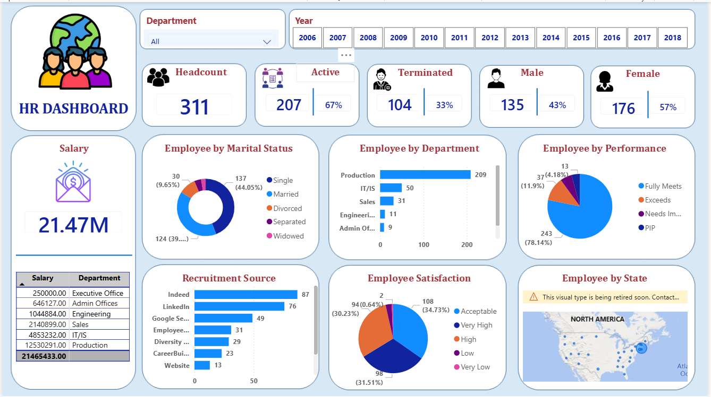

# HR Analytics Dashboard | Power BI

## Overview
An interactive HR Analytics Dashboard built using Microsoft Power BI to analyze employee demographics, performance, recruitment sources, salary insights, and workforce diversity.

## Features
- Total Headcount, Active & Terminated employees
- Gender diversity analysis
- Employee distribution by department and marital status
- Performance and satisfaction analysis
- Recruitment source insights
- Interactive filters by Department and Year

## Tools
- Microsoft Power BI
- DAX (Data Analysis Expressions)
- Data Modeling & Visualization

## Dataset
Public HR dataset sourced from Google Drive (used for learning purposes).

## Dashboard Preview

